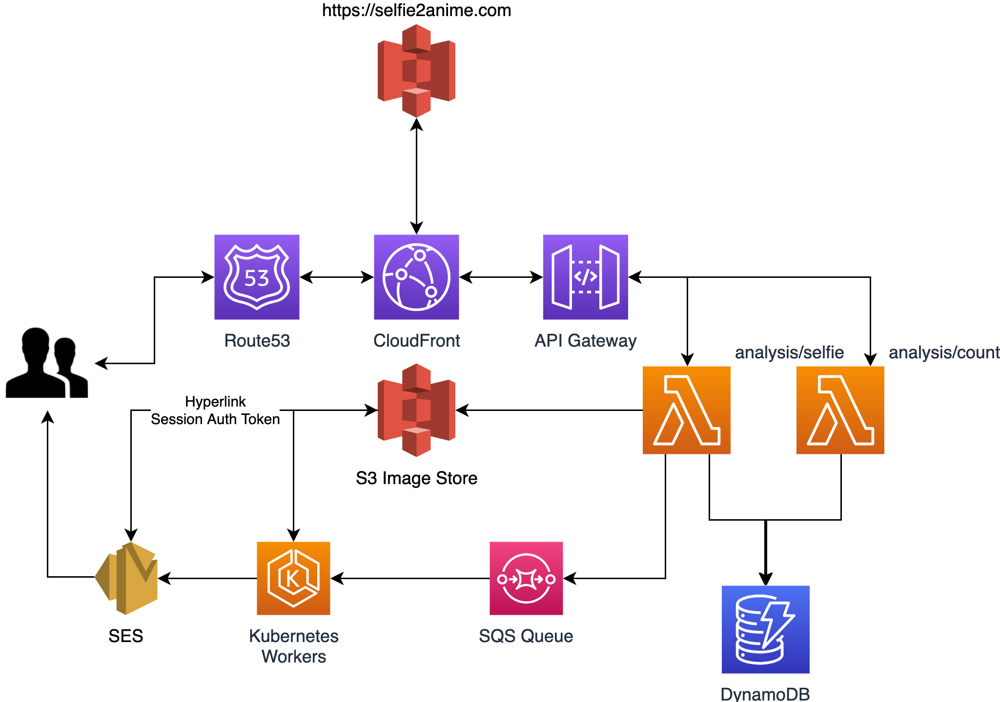

[](https://selfie2anime.com)&nbsp;
[](https://selfie2anime.com)&nbsp;
[](https://selfie2anime.com)

# Selfie2Anime

*What do YOU look like in ANIME?*

This repository contains the source code for the backend for the [selfie2anime.com](https://selfie2anime.com) website.

## How Does it Work?

Using machine learning techniques combined with a [Generative Adversarial Network (GAN)](https://en.wikipedia.org/wiki/Generative_adversarial_network) makes it possible to generate anime-style characters based on real people. With this website, you can generate your own anime alter ego!

The GAN we are using is based on original work by *Junho Kim*, *Minjae Kim*, *Hyeonwoo Kang*, and *Kwanghee Lee*. More information can be found in their awesome repository, which is [available here](https://github.com/taki0112/UGATIT), or in [their research paper](https://arxiv.org/abs/1907.10830).

## Components

Below is a general diagram illustrating the process our workers follow to process incoming requests



More information about the process seen above can be found in the following modules

* [image-handler](components/image-handler/README.md) - Image processing pipeline
* [UGATIT](components/UGATIT/README.md) - UGATIT environment from Junho Kim and Minjae Kim and Hyeonwoo Kang and Kwanghee Lee

## Attributions

Please cite the original author of UGATIT:

* [Junho Kim](http://bit.ly/jhkim_ai), Minjae Kim, Hyeonwoo Kang, Kwanghee Lee

```bash
@misc{kim2019ugatit,
    title={U-GAT-IT: Unsupervised Generative Attentional Networks with Adaptive Layer-Instance Normalization for Image-to-Image Translation},
    author={Junho Kim and Minjae Kim and Hyeonwoo Kang and Kwanghee Lee},
    year={2019},
    eprint={1907.10830},
    archivePrefix={arXiv},
    primaryClass={cs.CV}
}
```
